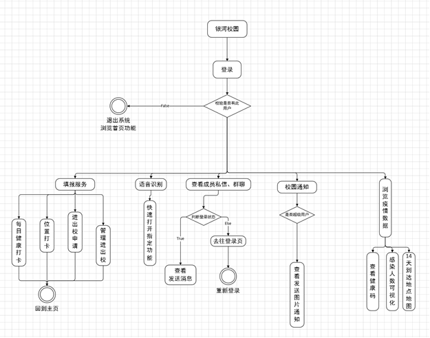
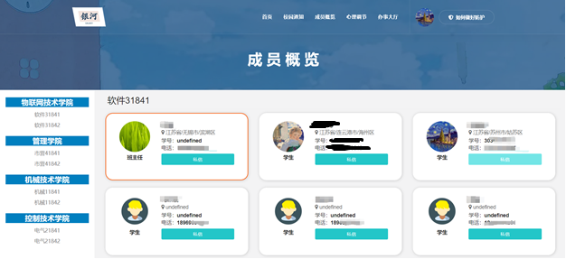

## 银河校园

使用SpringBoot+Mybatis开发后端，开发Bootstrap+Vue网页前端+安卓客户端+微信小程序端三端联通；开发登陆注册、信息打卡、位置上报、健康码评估、数据Echarts可视化、在线聊天等功能。其中使用PyTorch深度框架配合Flask轻量级python后端搭建接口，训练人脸检测模型（金字塔CNN+多级别Pool池化）产生人脸136处关键点，根据点信息的余弦相似度差异最小化快速二分查找，实现无需重新训练部署的人脸匹配接口，供登录系统使用。TCP协议WebSocket实现在线聊天系统，做到Http请求限制的客户端主动消息接收，设置B/S间的脉冲，确立心跳的机制保持不中断。功能实现了在线实时发送图片，视频，语音，消息等不同消息，并根据session id区分群聊与私聊功能。实现了根据用户打卡所在地判断风险等级，按照个体节点的经纬度二维坐标，进行定时的DBSCAN密度聚类算法归类，将离群点个体（非学校范围成员）自动调高风险等级；性能方面，考虑健康打卡接口并发，Docker容器搭建Mysql主从分离，开多重容错备份，防止单主机性能瓶颈；使用将单体后端Spring程序部署到多个Tomcat云服务模拟集群，使用nginx做反向代理，实现请求流量的合理负载分摊。ActiveMq消息队列的部署：旨在解决校园平台实时聊天场景中的WebSocket协议session集群共享问题，为了应对高并发，引入了MQ。部署redis缓存数据库，设置缓存机制减轻高并发接口压力。

## 会不断完善下去
### 先放出readme

### 系统功能

### 登陆界面

### 人脸识别

### 疫情数据

### 发布全校通知

### 后台

### 教师审核

### websocket在线聊天

### 聚类算法排除高风险定位

### 打卡提醒

### 心理健康小程序

### 项目结构
